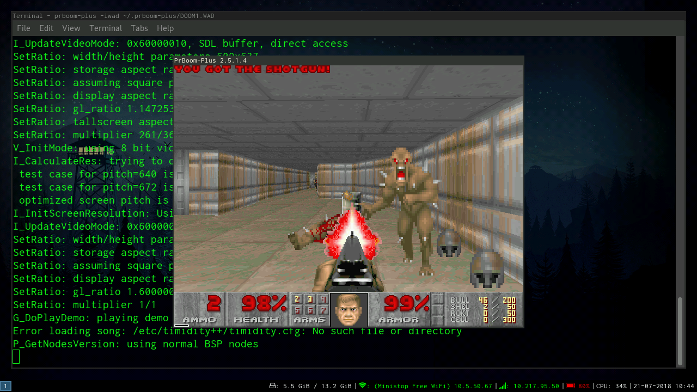
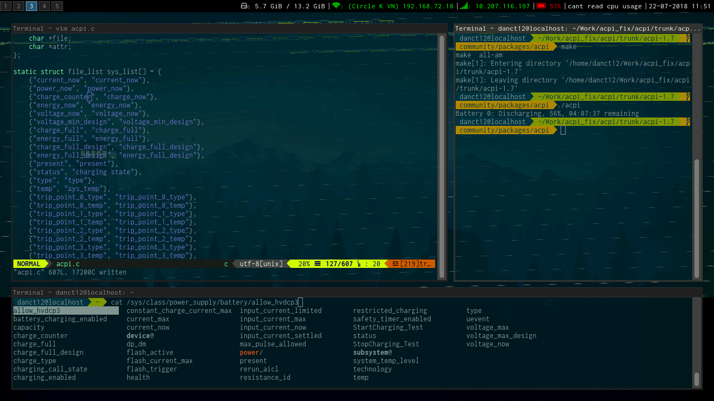
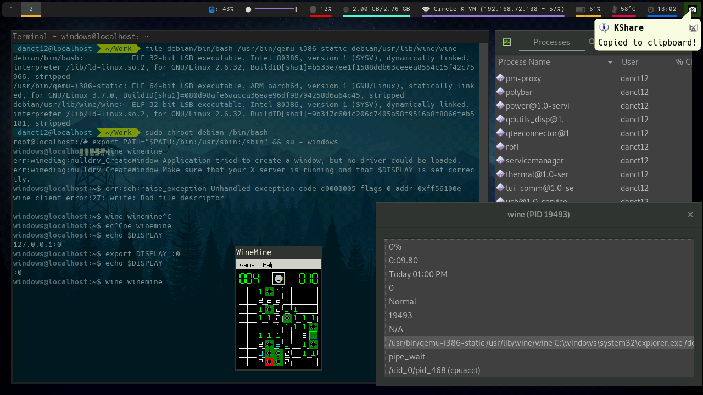
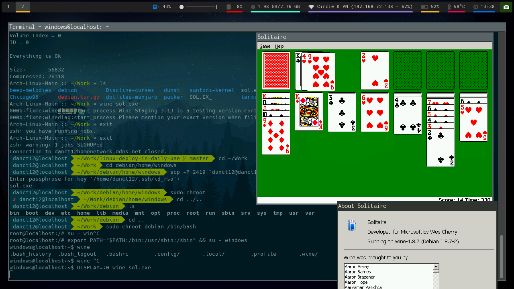

[DockBarX]: https://aur.archlinux.org/packages/dockbarx
[DockBarX-XFCE]: https://aur.archlinux.org/packages/xfce4-dockbarx-plugin
[XSDL]: https://play.google.com/store/apps/details?id=x.org.server
[LinuxDeploy]: https://play.google.com/store/apps/details?id=ru.meefik.linuxdeploy
[RRSite]: www.resurrectionremix.com
[GWTChannel]: https://www.youtube.com/user/GrayWolfTech
[blu3bird84Channel]: https://www.youtube.com/channel/UC6sPjwb6XCjkmGZuaICi2PA
[neovim.io]: https://neovim.io
[fakeroot-tcp-aur]: https://aur.archlinux.org/packages/fakeroot-tcp
[KernelAdiutor]: https://play.google.com/store/apps/details?id=com.grarak.kerneladiutor

# Day 1: (June 22, 2018)

The first day of [Linux Deploy][LinuxDeploy], after installed it at home, I went back home from school, instead of going back to home, I went to a shop stop to just use it.

The first day of using it, there was pretty much not ready setup yet. I have to install base-devel just to be able to compile stuffs.

I thought that I was be able to compile programs out of the box from AUR, but I was wrong, there was a error with fakeroot, which telling me that function is not implemented, turns out to be my kernel (that comes with [Resurrection Remix][RRSite] 6.0.0) doesn't support the function that fakeroot uses.

With that being said, I gone plan B, [fakeroot-tcp][fakeroot-tcp-aur]. This simulates fakeroot, which is a win win, but sadly I have to gone through modifications.

After done, I built the package and install, and there, I was able to compile stuffs from AUR just fine.

I compiled [DockbarX][DockBarX] and [DockbarX plugin for XFCE][DockBarX-XFCE], both going without any problem, but except that I have to edit PKGBUILD to support aarch64, which is my architecture that the phone is running on.

Second problem is, Midori doesn't work properly on this, it keeps crashing everytime I open a website, so I installed firefox and it works just fine.

Third problem is, my favorite text editor [NeoVim][neovim.io] doesn't exist on aarch64 for ARM, but I'm saving it for the another day.

# Day 2: (June 25, 2018)

Back from the English school, here I am back again.

I compiled NeoVim, it was a very slow task due to makepkg running on one thread, I forgot to edit it.

Works fine, no issue.

# Day 3: (June 27, 2018)

God dang it! How much I hate Android system, I cannot unbind the Super (Windows) key and the Alt key just to make applications use it, whenever I want to do alt tab in [XServer XSDL][XSDL], it'll keep going to the android recent menu.

But I have a fix for that, it's a temporary work around, i know it's dumb but it works. By editing /system/usr/kblayouts/Generic.kl, I bound the Windows key to Volume Up and the Alt key to Volume Down, then changing the settings inside Linux Deploy to bind both keys to them. Now I have a working Super and Alt key for me to use!

As because it worked, I installed i3-gaps to replace XFCE, and here I am!

I uninstalled Midori and Firefox because it was laggy and installed Chromium instead, the performance on Chromium is quite better than others.

I removed some unused packages just to save some spaces, it is amazing that a ton of spaces was used and left me with 3.5 GB, hopefully i'll extend that some time in the future.

I got dunst up and configured.

Just to entertain my self, I installed xbill (old X11 game) just to have some fun tapping bills, but also I got it to play soilitare! How cool is that! :D

End of the day, I think it's a decent netbook if you have rooted it and run Linux, I'd suggest you to have root and install Linux Deploy Arch, this might turn your phone into a decent 2 in 1 netbook that you can also call, sms, and be able to run linux applications too.

# Day 4: (June 28, 2018)

I got the battery reporting system to work with i3status, the uevent file is located in /sys/class/power_supply/battery/uevent

Chromium on this phone doesn't play videos, it'll just show a few frames of it and then freezes. So a workaround is to use mpv + youtube-dl.

I just extended the disk image from 6.8 GB to 13 GB, I did this because the space was running out and I need more space on doing this experiment.

The next thing I should try to do is to get Wine/x86 on ARM, this way, I can play Windows XP Solitaire (my favorite actually), and might be able to install BonziBUDDY. It might be a fun thing to do, but will also be fun on getting it to work, the thing I have to do is to compile QEMU with NPTL patch.

I tried to emulate NES, SNES so I can play Super Mario World, but sadly the results aren't happy.

SNES9x is on Arch Linux ARM repo, but sadly it doesn't boot to any games, all it boot to was just a plain black screen, no error messages in the terminal, that's pretty much it, just a black screen.

higen cannot do SDL, when I launch it with video as SDL, it crashes.

mednafen crashes on startup.

Turns out it's not my fault but rather a problem with ARM processors, so the idea of playing Mario on a Linux phone is no more.

# Day 5: (June 29, 2018)

I just installed SuperTux 2, it's the good game I have played on the phone, but also playable as well, it's quite fun, it runs at 60 fps.

I still haven't setup Wine on ARM yet, that's because I don't have time to compile it, it takes a whole load of time because of Linux Deploy runs on a core (even if it's chrooted), I have made a issue on meefik's github ( https://github.com/meefik/linuxdeploy/issues/973 )

The next thing I'll do is to setup VirtualGL (on my host computer), so I can run OpenGL applications, it might be a bit laggy but it's not going to be really bad (hopefully). :)

I found a way to change the brightness for the LCD screen, it's at **/sys/class/leds/lcd-backlight/brightness** 

Just echo the value to there and the brightness will be changed, you probably can use this to change the brightness without using the slider from Android, or make use of some programs like xbacklight.

# Day 6: (June 30, 2018)
I have setup a virtual machine runs Debian 9, it uses 4 cores and 2 GB of RAM on my home PC. I did set up X11 Forwarding, SSH and port forwarded my virtual machine to the internet.

Now I can use my virtual machine when I'm not at home, and also be able to connect to my home PC too!

I run serveral programs on my VM and actually it works quite well, but slow a little bit. Because of this, I set up a VNC server on it and connect to it, the internet here is bad, so I connected to it with the crappiest graphics setting, like 8 colors, compressions to the max, blah blah.

I was able to play Super Mario World on it! But not at full performance, but you know what? It works.

I cannot run firefox through X11 Forwarding tho, firefox keeps telling me that it wasnt respond and tell me to kill it, so I used midori to open my VNC port.

I can also run a desktop version of Discord on my home PC! But it takes too long to load so I quit doing it.

**VNC GLXGears:**

# Day 7: (July 1, 2018)

Back with it again, I got Kdenlive running on ARM, it actually works but I don't recommend you to use it as a mini video editing machine. Android is rude at resource giving, because they only left you with a little bit resource (a gig) at least on a 3 GB machine here, and since Linux Deploy only runs on single-core, rendering movie will be a pain, so good luck doing it. :D (fyi the video takes 2 minutes to done rendering)

Also, finally someone notice me using a phone PC.

I might recommend you to use a phone with large RAM, like around 4 or 6 GB, that might let you a ton resources, but why do it when you can bring a giant laptop or a netbook.

Ok, that was it, that's something big I done today.

But if you want proof for the video rendered on Kdenlive ARM, check out kdenlivesample.webm

# Day 8: (July 2, 2018)
I figured out how to get Linux Deploy to use all cores instead of just one. I downloaded [Kernel Adiutor from Google Play][KernelAdiutor], in the settings, disable Core Control from Thermal, then enable all cores in the CPU tab, you probably want to set it to Performance mode and make use of high cpu frequency, this way it'll force all cores to work, thus making it to detect them all.

Now you can compile without being in pain! :D

You can check "Apply on Boot" but i'm sure you guys won't since it'll waste battery power, cause you know, Core Control was made to prevent battery consumption, it's pretty much like Speedstep on Intel CPUs.

To reset the settings, you probably want to restart your phone, it'll reset the settings back to default.

I just switched to a new text editor this time, tired of NeoVim, it's called Spac(emacs), I might want to try to learn emacs, but now I'm currently using evil Vi mode. :P

**I made a guide on this, check out the Wiki section of this repo**

# Day 9: (July 5, 2018)
Found a way to do GLX Software Rendering, but that also bug the eff out of all applications, Supertux runs with 2 FPS, before it was 8 FPS on the main menu, and making everything unplayable, Chromium doesn't display anything.

VirtualGL doesn't work at all, GLXInfo segfaulted, glxgears doesn't work and break, I made a issue on VirtualGL github, hopefully there's a way to fix this, or at least, a workaround. I want to play Hacknet on phone! :\

Beside that, I got Arch Linux ARM running on my Zenfone Go (Z00VD) via framebuffer. I have to say that it **actually** works, but with OpenGL being software-rendered, there's no way to do hardware OpenGL on framebuffer, or at least no one did it yet. But I'm sure VirtualGL will work. But I can't use it as a daily driver, because it doesn't support USB OTG (blame ASUS).

Rain's over, going back to home before it's doing it's raining job again.

# Day 10: (July 9, 2018)
Did a fresh install of Arch Linux ARM, because the previous installation was broken due to me installing MATE desktop and then switch back to i3. What a shame.

I just customized i3status with font-awesome-4 (5 sucks), today I switched to another shop stop nearby, and for me it's a ok-ish experience here, it has another floor which you can see motorbikes and cars running around outside, including people walking around. :)

I kinda like my new i3 setup tho, not kidding. But this time I don't use the status bar on top anymore, rather i use it at the bottom since the screen protector is covering the top bar, making it difficult for you to see.

As well, instead of using Thunar, I'm with nautilus because it's a good file manager, I use it on my main PC too.

# Day 11: (July 10, 2018)
Today on, I went on the same place again, and then they see me using this setup. They're interested in it and asking me serveral questions.

That aside, I bought a new wired mouse and keyboard, since the previous wireless keyboard alt key was broken, which is pretty important, the total setup costs 160 000 vnd (about 6$ in US), not including the USB hub because I got one at home, and this one isn't working pretty well, don't know if it's the hub, but i'm sure it is since both kb and mouse decide to give up and disconnect in the same time. (or that might be just my phone circuit protection thing)

And this wired keyboard is some fake Apple keyboard, but surprisingly works pretty well, sadly this is not a ideal keyboard for Linux since it doesn't have a SysRQ (Print Screen) key. And since it's a apple keyboard, seriously, they carved the Apple logo on the spacebar, which is pretty misleading, and it's not a sticker so you cannot tear it off, had to use a paper knife i got around trying to cut it off, sadly it screws up the feel, but that's okay, it's in the center which i dont touch much so... /shrug

The mouse is a DELL MS111-P, it works pretty well anyway, just like a standard mouse that everyone uses, and it works pretty okay.

The USB Hub is some no-name 7 ports USB hub, i'm sure this is the reason why my phone circuit protection thing kicks in and disable the hub.

Anyway, if [XServer XSDL][XSDL] can do 3D hardware acceleration (OpenGLES), this MIGHT be the end of netbooks.

It's raining now and the sky has been like this for days, so I don't think I'll be back home anytime soon until the rain ends.

I also switched to aurman instead of packer because packer went unmaintained (i know this before) and AUR 3.0 is causing duplicate files causing it not to install.

Dammit forcedoze! It hanged my internet for just letting the screen down for less than a second. Here's my lesson, don't let the screen down if you're downloading something. (if you have disable mobile data and wifi)

Anyway, I got GTK YouTube Viewer installed, and you know what? It does play YouTube videos just fine, make sure set the quality so you dont ran into a 4k quality on a small screen (and it'll burn out your CPU)

Video by [GrayWolfTech][GWTChannel]

NOT ENOUGH FUN YET?? IT PLAYS 720P VIDEOS TOO!

Video by [blu3bird84][blu3bird84Channel]

P.S: Never stream YouTube through browsers on this platform, it won't work :'(

I changed the i3 config a little bit, for optimizing mpv and feh, since those things will always go tiling mode, and might be annoying for some people.

# Day 12: (July 11, 2018)
With a simple modification to acpilight, it is now compatible with Android, I can now just run it like you're running xbacklight on your laptop.

One cool thing is that it's identical, the only thing Google changed is the path to the backlight stuff.

I also riced my WM so it looks pretty good on eyes, and Discord goes fit with the theme. I use Equilux as my theme.

Excuse for the non-edited bottom bar, I was lazy lol.

Just for your curiousity, the wallpaper is Firewatch, you can find it online.

The next thing I'll do is making the battery manager thing to work with Android kernel, it might be interesting if someone here uses XFCE as their DE and needs a Power Manager, so you don't slip down the top bar.

By the way this WiFi needs your (little) personal information if you want to go in, so I gave it fake information, the new Windows 10.

Also I'll see if I can get WiFi Connect Utility to work with Android, it might be the same, but not exactly same, never tried so I don't know.

**UPDATE:** I just checked WineHQ ARM page, and it was just recently updated a few days ago, they has some new information about emulating X86 apps on ARM: https://wiki.winehq.org/Emulation

They mentioned a brand new project that I have never heard of called hangover, which you can run amd64 programs on arm64.

So it might be possible to run BonziBUDDY on it, and play Windows solitaire. I'll try it when I get back home.

# Day 13: (July 12, 2018)
I was not able to compile Wine on ARM (just yet), because it requires a toolchain that supports Thumb, which mine doesn't have.

However, you can use QEMU to run x86 on ARM, but you need a x86 chroot environment, and then you can do it just fine.

Sadly, Internet right here is a bit crappy so I couldn't do it just yet.

I'll do it when I'm back home, but that shouldn't be hard todo since if you can run bash x86 on qemu, it'll be possible to run everything else. The image size of chroot will be 4 GB, because I almost run out of space on this thing again, might see which is wasting so much spaces.

Turns out it's just my Windows 98 image file i leftover, that thing was very slow af, so I don't think I will ever try emulating system again. (was expecting this)

# Day 14: (July 13, 2018)
Didn't managed to do the qemu + wine thing yet, because qemu-user-static doesn't work at all, the packages on debian for arm64 are all corrupted for some reason so it doesn't work.

I'll try to look for a different source, might help.

I think I'm starting to ditch bash, now I'm currently using zsh.

# Day 15: (July 14, 2018)

I don't know if I'll be able to keep up doing this, because the thing is that I couldn't get 3D Rendering on XServer XSDL via hardware, hopefully there'll be the same software but has 3D rendering.

And compiling GZDoom on ARM is painful as hell, couldn't get it to compile even with OpenMP up, must be missing something. I'll keep trying.

If I'll be able to get GZDoom on ARM, i'll make a update on this.

# Day 16: (July 21, 2018)

I got Doom to work!! And no, GZDoom is a pain to compile on ARM since it keep saying that it's missing OpenMP while I already have it installed, what a shame.

But instead of GZDoom, PrBoom compiled very nicely, no errors and /r/itrunsdoom! It plays with almost no lag, this is something I have ever wanted to play on this experiment.

Special thanks to @GaugeK#1452 from r/unixporn Discord for suggesting me PrBoom because of a video he posted on.

If you want to join the unixporn discord here's the link: https://discord.gg/XPd2wet

# Day 17: (July 22, 2018)

I got ACPI to report battery from Android, but this is way more accurate than Android I guess.

With just a simple tweak in the source code, from charge_now to charge_counter, this has now working for Android phones, special thanks to gwimm from unixporn Discord for providing me the entire folder of his battery and let me analysis.

This also has opened the door for many other power manager like XFCE4 Power Manager to finally know the amount of battery.

Source code and ready to deploy package for 64-bit ARM are here:

Ready to deploy package: https://cdn.discordapp.com/attachments/362104382516363265/470460528452698113/acpi-1.7_android-2-aarch64.pkg.tar.xz
Source code: https://cdn.discordapp.com/attachments/362104382516363265/470461550109523978/acpi-1.7_android-source.tar.gz

I also left it at home and charge, and you know what? It actually charges and for some really weird reason, after that the battery starts to show correct percentage.

# Day 18: (July 23, 2018)
I rericed my desktop, I wish I can submit it to unixporn but I think that no one will like it much :V

https://imgur.com/a/sagzDCN

# Day 19: (Evening, July 24, 2018)
I tried to compile my phone kernel to add support for binfmt and sysvipc (if needed later), there are some #include error but I was able to get around that by changing the #include to correct file path. The kernel compiles just fine, but one problem:
When I try to boot the kernel, terminal outputs: "dtb not found", which means that I can't boot the kernel.

I don't know why, every tutorials I check online are just nothing, config the kernel and there it is, the zImage (32-bit ARM),  Image (64-bit ARM) are here, get that and flash to your phone, or just boot it, no external steps required.

I was never able to find any guides on how to compile the kernel for this phone, but without rebuilding the kernel, it is impossible to make a x86 chroot on ARM and then chroot to it.

Here's the kernel I use: https://github.com/Nikesh001/android_kernel_xiaomi_msm8937

I'll try it later when I get back home, hopefully I'll be able to find a way to boot this kernel with dtb's.

One thing I realized why dtb aren't copied properly after compiling kernel is that there are no Image-dtb, this makes me thinks that something is screwing up.

# Day 20: (July 25, 2018)
Today, I tried to compile kernel for my phone again, and finally, I compiled the kernel (probably) properly without modifying any sources.

All I did was:
- Download Google's Android Toolchain
- Download kernel sources
- Doing export CROSS_COMPILE and ARCH like usual, pretty much every tutorials will just tell you to do this.
- Run make clean & make mrproper
- make O=output santoni_defconfig
- make O=output -j9

Untested, but seems like Image.gz-dtb now compiles properly, I know this because both files (Image.gz, Image.gz-dtb) has different size than before, the dtb is sightly larger than the non-dtb by 6 MB, meaning that this file is compiled properly and can be run on a production phone.

I'll try to boot it when I'm back home with my desktop computer.

I'll be my own maintainer! :D

Pushing the new commit now, will make another commit when I did something new.

FYI, this was all done on my desktop PC with 8 GB of RAM and i7-6700k.

### Continue of Day 20

I got my kernel booted, but you have to make it into a boot.img file, for this you need Android Image Kitchen, and your boot.img.

Unpack the boot image with AIK then go to split_img folder and change delete boot.img-zImage, then get your Image.gz-dtb to the same folder, rename it to the file that you just deleted (boot.img-zImage).

After that, repack the image and you should be able to boot it through fastboot, if it actually boots to your kernel (you can confirm this by goto "About Phone"), check to see if all functions are working properly, then you can flash your new boot.img to your phone.

# Day 21: (July 26, 2018)
Installing Debian chroot in a chroot, what's wrong?

I think Debian is quite good for this kind of experiment, you probably don't want to install x86 binaries on an ARM.

This way, I'll be able to install Wine and run x86 programs! I could have used pacstrap to install Arch but I don't want to do that.

# Day 22: (July 27, 2018)
I compiled Polybar with fixes for Android devices running Snapdragon, you can find the link to it on my Discord. https://discord.gg/AvtdRJ3

This is awesome, this is also one of the big thing I've done.

To run Polybar on XServer XSDL, you need to enable the default monitor, you can check out wiki for tutorial on how.

# Day 23: (July 28, 2018)
I realized that this phone turns very very hot if you use Linux on a phone without a block of ice or air conditioner, and never use chrome without them because as soon you launch chrome, chg_temp turns insta 60 degrees.

Also, I'll start trying to run x86 apps through Wine in a few days, it should work hopefully, and this will mark as new stuffs that has done. Keep in mind that it'll be slow because you're trying to emulate x86 on a non-x86 architecture.

I saw Exagear running x86 programs, sadly it's a commercial product and some people claims that QEMU + Wine is way more better.

# Day 24: (August 1st, 2018)
Happy the 1st of August! Anyway, I downloaded Debian Stretch on my home PC, I'll go to Circle K to transfer the folder.

Last time I did it with a dd image, it mounts on my home PC, but not on this phone, that's kinda weird, there's no helpful information regarding the error.

Now this time, I'm doing it with just a folder, let's see how that goes.

I'm not surprised but Debian folder is only 738 MB even after I installed Wine on it.

Seems like Wine works but it doesn't work for me due to X11 Authentication Failure, pretty sure it's my fault for running it through a SSH X11 Tunnel.

Anyway, mobile network is a pain in the ass to use, even they provided it free because I spent 2$ on the fund of the data.

Now I have to go to ~~Starbucks~~ Circle K to use their 2 MB/s Wi-Fi.

I wonder.. if this will going well..?

Beside that, welcome back to school, kids (or students)!

Seems like Circle K is now full of people, and the network is throttling alot, so sometimes I get 1 MB/s and later on it turned to a piece of junk speed.

At the current time writing, congrats for reaching 4,182 words, including this message.

Seems like this has mark the end of this experiment, look at what I just did...

But there's only one checkmark that haven't done yet in TODO.MD, let's complete that and end this experiment.

Ok ok, before we start doing that here's a picture of it running solitaire at 1 FPS

(just kidding it doesn't run with 1 FPS)

Anyway, it's very playable but I don't want to imagine playing old games on this (pls leave me alone i dont want to play those with 0.1 fps)

Anyway, people are asking me to beat solitaire, I'll be uploading it to YouTube soon.

Pinball works as well, which is cool!

Here's the list of programs I tried:

Programs that are known to run:
- WineMine
- Windows XP Solitaire (extracted from Install CD)
- WineFile
- 3D Space Cadet!! (WOOO!!): RUNS VERY FAST WHOA!! :O
- Windows XP MSPaint

Programs that are KIND of works:
- Wine Desktop

Programs that are not gonna work:
- BonziBuddy: Installer kind of works, but then at the final stage of installing it crashes because of QEMU's unimplemented syscall. And the program doesn't run.
- VirtuaNES: Unimplemented syscall

# Day 25: (August 3rd, 2018)

At MiniStop once again, just as for something, I think I love this computer way more than my home PC! I'm still waiting for my x86 tablet to come back from warranty, after that it'll be my own laptop since no one uses it anymore.

The reason why I love this computer is because I never got a laptop, ever before because I don't see a need for it.

And the entire point of the experiment is to bring this setup to the public, like a coffee shop or something and see if someone notices it.

The entire experiment was based on a Google video that was made in 2008, featuring a guy typing on a *small* phone like a desktop style. ( https://www.youtube.com/watch?v=Pgsw-NgDoFE )

